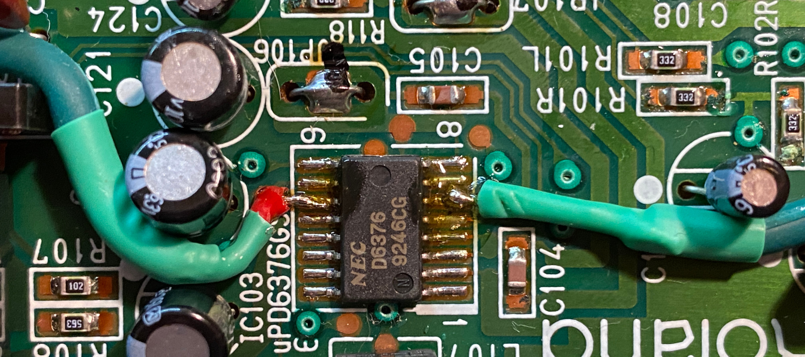
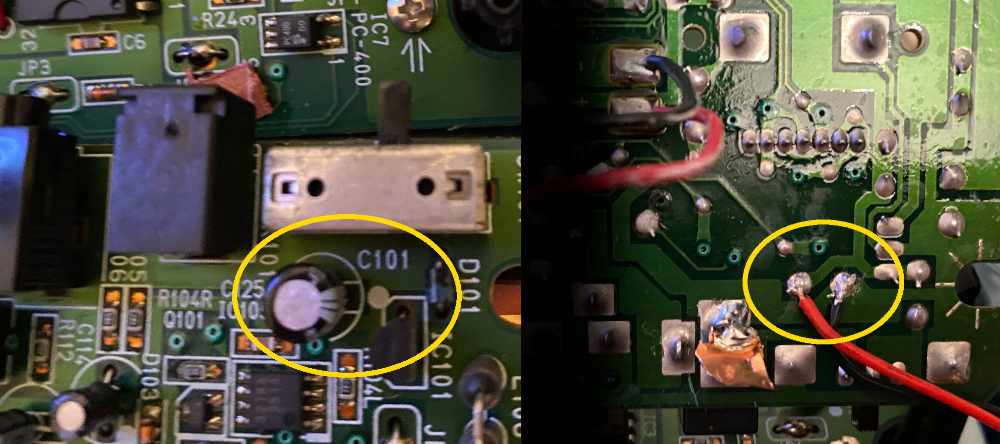
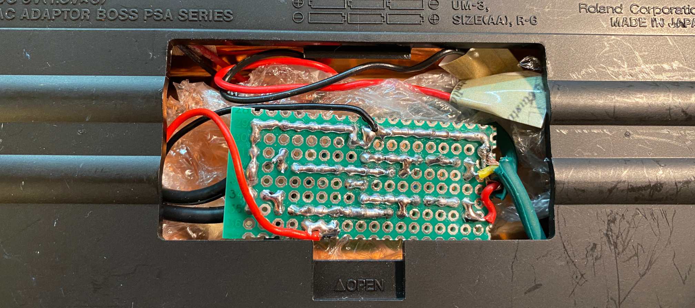

# Fixing Dr.Rhythm DR-550 MKII 

**WARNING!** This is the documentation of how I fixed my DR-550 MKII. This is not a tutorial and this is not a recommendation. Trying to fix your machine this way may lead to irreparable and ultimate damage. It definetly would modify it irreversible. Please note that all modification of your device is on YOUR OWN RISK AND RESPONSIBILITY.

I got one of those defective DR-550 MKII with extremely low and noisy signal on the outputs. And I couldn't find any documentation on how to fix it. But it was a huge help to find the "service notes" manual online, including the circuit diagram of the entire machine here: https://www.synthxl.com/boss-dr-550-mkii/ (PDF: https://www.synthxl.com/wp-content/uploads/2020/03/Boss-DR-550-MKII-Service-Notes.pdf)

I could hear the signal very low on the left headphone which gave me hope that the entire digital part of the machine would be ok and that just the analog output amplifiers would be the problem. I was not able to find any visual indications of faulty components. Capacitors and everything else looked good. So the next idea was to find the output pins of the digital-analog converter (DAC) to see if there was actually a proper analog signal produced.

With the help of the service manual I was able to identify IC103 as the DAC chip and PINs 6 and 11 to be the primary analog output pins. So I build the following simple stereo amplifier in order to connect the machine to other audio devices, in my case my mixer.

Warning! Your device may suffer from a different problem and imitating the following steps might not solve your problem. Opening and/or modifying your device is on your own risk and it is very likely that you will loose any warranty. Some of the following steps modify the device irreversibly. This is a documentation of what I did. This is not a tutorial, not even a recommendation.

## Amplifier

I experimented with different values for the components and this was the first attempt delivering a usable signal to my audio mixer. I am sure this can be done better. Feel free to make suggestions for a better amp.

## Modifications

I attached the Amplifier to Pins 11 and 6 of the DAC IC103 which provide the left (11) and right (6) analog audio channels.

Analyzing the original circuit diagram of the DR-550MKII I identified the capacitor C101 as the perfect spot to attach wires for stealing +9V in order to power the amplifier. 

(Left: top side, Right: bottom side with wires attached)

## Damaging

In order to get the output out of the case I cut the axis of the original volume potentiometer. I also cut open the folio at several points.

## Putting it all together

Eventually I removed the battery compartment completely in order to use the space for the amplifier.

I also removed the now uselss volume knob. Instead I designed a case for a 3.5mm jack fitting perfectly where the former volume knob was.

The 3D model is pre-rotated for optimal printing.

**WARNING!** Any of the above steps can ruin your device! Opening or modifying your device is on your own risk!
